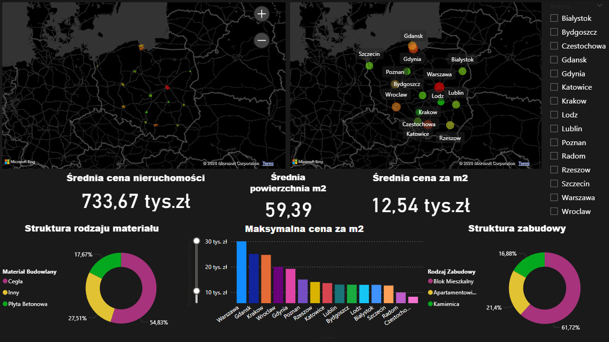
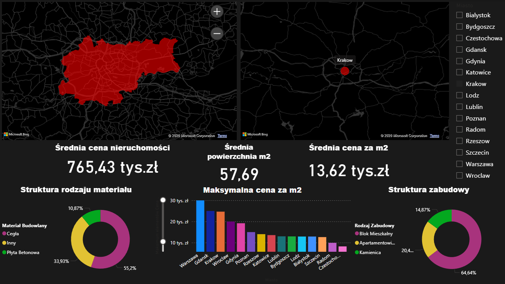
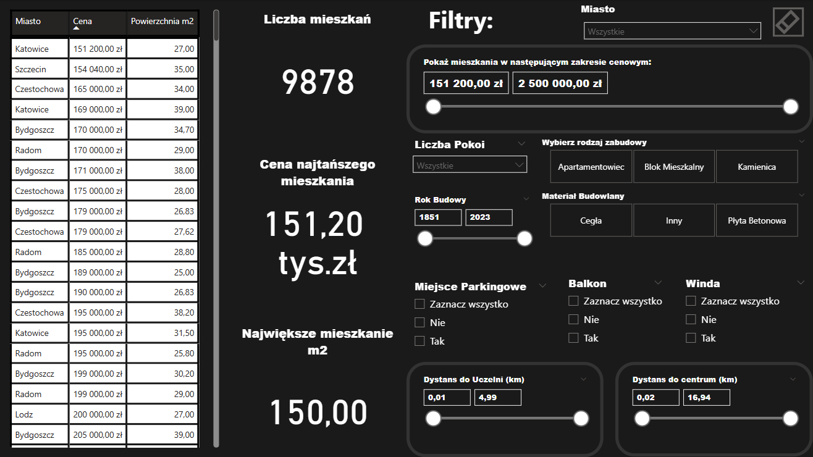
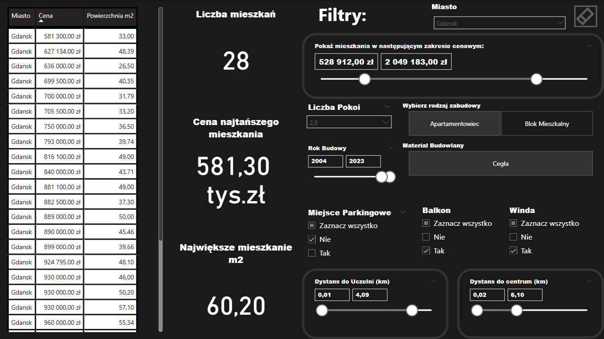

# 🏢 Analiza Rynku Nieruchomości — 15 Miast Polski (2023)


> Interaktywny raport BI do analizy **9 878 ofert mieszkaniowych** z 15 największych miast Polski. Umożliwia porównanie cen rynkowych oraz precyzyjne wyszukiwanie nieruchomości według 11 kryteriów jednocześnie.

---

## 📌 Spis Treści

- [Cel Projektu](#-cel-projektu)
- [Kluczowe Wnioski](#-kluczowe-wnioski)
- [Przegląd Raportu](#-przegląd-raportu)
- [Proces ETL](#-proces-etl-extract-transform-load)
- [Kolumna Kalkulowana](#-kolumna-kalkulowana-dax)
- [Stack Techniczny](#️-stack-techniczny)
- [Struktura Plików](#-struktura-plików)
- [Źródło Danych](#-źródło-danych)
- [Autorzy](#-autorzy)

---

## 🎯 Cel Projektu

Przekształcenie surowego pliku CSV z ogłoszeniami mieszkań w narzędzie analityczne, które odpowiada na dwa pytania:

1. **Jak wygląda rynek?** — porównanie cen za m², struktury zabudowy i materiałów budowlanych między miastami
2. **Jakie mieszkania spełniają moje kryteria?** — wyszukiwarka z 11 filtrami (cena, metraż, pokoje, winda, balkon, parking, materiał, rok budowy, dystans do centrum/uczelni i inne)

---

## 📊 Kluczowe Wnioski

| Wskaźnik | Wartość (cały rynek) | Kraków (przykład) |
| :--- | :---: | :---: |
| Liczba ofert | **9 878** | — |
| Średnia cena | 733 670 zł | 765 430 zł |
| Średnia powierzchnia | 59,39 m² | 57,69 m² |
| Średnia cena za m² | 12 540 zł | **13 620 zł** |
| Najniższa cena | 151 200 zł | — |
| Najwyższa cena | 2 500 000 zł | — |

**Obserwacje rynkowe:**
- 🥇 **Warszawa** osiąga najwyższe maksymalne ceny za m² (~30 tys. zł), wyprzedzając Gdańsk i Kraków
- 🏗️ Dominujący materiał budowlany to **cegła (54,83%)**, co odzwierciedla starszą tkankę miejską
- 🏙️ Rynek zdominowany przez **bloki mieszkalne (61,72%)**, apartamentowce stanowią 21,4%
- 💰 Najdostępniejsze cenowo miasta: **Katowice i Częstochowa** — oferty już od ~151 tys. zł
- 📐 Kraków droższy i bardziej zagęszczony niż średnia krajowa (wyższa cena/m², mniejsza śr. powierzchnia)

---

## 📸 Przegląd Raportu

Raport składa się z **3 stron** zaprojektowanych w ciemnym motywie (Dark Mode UX).

---

### Strona 1 — Wprowadzenie
Strona tytułowa z identyfikacją wizualną projektu.

---

### Strona 2 — Ogólne Dane Rynkowe

Przegląd całego rynku z dynamiczną filtrowalnością po miastach. Każde kliknięcie natychmiast przelicza wszystkie KPI, mapy i wykresy.

| Pełny zbiór danych (9 878 ofert) | Zawężony do Krakowa |
| :---: | :---: |
|  |  |

---

### Strona 3 — Wyszukiwarka Nieruchomości

Narzędzie dla użytkownika końcowego. Pozwala zawęzić tysiące ofert do kilku pasujących w kilka sekund. Przycisk **Reset** przywraca wszystkie filtry jednym kliknięciem.

| Wyszukiwarka (stan domyślny) | Wyniki po zastosowaniu filtrów (Gdańsk) |
| :---: | :---: |
|  |  |

*Przykład: Gdańsk, 2 pokoje, apartamentowiec, z windą i balkonem, cegła, rok budowy 2004–2023 → **28 ofert**, najtańsza 581,30 tys. zł*

**11 dostępnych filtrów:**

| Filtr | Typ | Opis |
| :--- | :--- | :--- |
| Miasto | Lista rozwijana | Wybór jednego miasta |
| Zakres cenowy | Suwak (range) | Min–Max cena w zł |
| Liczba pokoi | Lista rozwijana | 1, 2, 3, 4+ |
| Rodzaj zabudowy | Przyciski | Apartamentowiec / Blok / Kamienica |
| Rok budowy | Suwak (range) | 1851–2023 |
| Materiał budowlany | Przyciski | Cegła / Inny / Płyta Betonowa |
| Miejsce parkingowe | Checkboxy | Tak / Nie |
| Balkon | Checkboxy | Tak / Nie |
| Winda | Checkboxy | Tak / Nie |
| Dystans do centrum | Suwak (range) | 0–16,94 km |
| Dystans do uczelni | Suwak (range) | 0–4,99 km |

---

## 🧼 Proces ETL (Extract, Transform, Load)

Surowy plik CSV (`apartments_pl_2023_08.csv`) — **18 905 wierszy**, 28 kolumn w języku angielskim. Pipeline w **Power Query (język M)** obejmuje **59 kroków**. Po oczyszczeniu pozostało **9 878 rekordów** (odfiltrowano **~47%** danych).

**Usunięte wiersze (8 kroków filtrowania):**

| Warunek | Powód |
| :--- | :--- |
| `type <> ""` | Brak rodzaju zabudowy |
| `Piętro <> ""` | Brak numeru piętra |
| `Rok Budowy <> null` | Brak roku budowy |
| `Dystans do szkoły <> ""` | Brak dystansu do szkoły |
| `Dystans do Restauracji <> null` | Brak dystansu do restauracji |
| `Dystans do Uczelni <> null` | Brak dystansu do uczelni |
| `Dystans do Apteki <> null` | Brak dystansu do apteki |
| `hasElevator <> ""` | Brak informacji o windzie |

**Usunięte kolumny:** `floorCount`, `poiCount`, `clinicDistance`, `postOfficeDistance`, `kindergartenDistance`, `ownership`, `condition`, `hasSecurity`, `hasStorageRoom`

**Standaryzacja wartości (15 kroków):**
```
Rodzaj zabudowy:    blockOfFlats → Blok Mieszkalny  |  apartmentBuilding → Apartamentowiec  |  tenement → Kamienica
Materiał budowlany: brick → Cegła  |  concreteSlab → Płyta Betonowa  |  "" (null) → Inne → Inny
Wartości logiczne:  yes → Tak  |  no → Nie  (Miejsce Parkingowe, Balkon, Winda)
Separatory:         "." → ","  (dostosowanie do polskich ustawień regionalnych)
Miasta:             Text.Proper  →  warszawa → Warszawa
```

---

## 📐 Kolumna Kalkulowana (DAX)

Model nie zawiera jawnych miar DAX — karty KPI korzystają z domyślnych agregacji Power BI. Jedyną formułą jest kolumna kalkulowana:

```dax
Cena za m2 = 
'Dane Nieruchomości 15 Miast'[Cena] / 'Dane Nieruchomości 15 Miast'[Powierzchnia m2]
```

---

## 🛠️ Stack Techniczny

| Narzędzie | Zastosowanie |
| :--- | :--- |
| **Power BI Desktop** | Tworzenie raportu, wizualizacje, UX |
| **Power Query / M** | ETL: czyszczenie, transformacja, modelowanie danych |
| **DAX** | Kolumna kalkulowana (Cena za m2) |
| **Bing Maps** | Wizualizacje przestrzenne (mapa punktowa + choropleth) |

---

## 📂 Struktura Plików

```
📁 poland-housing-analysis-pbi/
├── 📄 README.md
├── 📁 data/
│   └── apartments_pl_2023_08.csv
├── 📁 reports/
│   └── poland-housing-market-analysis.pbix
└── 📁 screenshots/
    ├── 02-market-overview-all.png
    ├── 02-market-overview-filtered.png
    ├── 03-property-search-raw.png
    └── 03-property-search-filtered.png
```

---

## 📦 Źródło Danych

**[Apartment Prices in Poland](https://www.kaggle.com/datasets/krzysztofjamroz/apartment-prices-in-poland)** 

`apartments_pl_2023_08.csv` · 18 905 rekordów · 28 kolumn · dane z sierpnia 2023 r. 

---

Projekt zrealizowany w ramach przedmiotu **Business Intelligence** na Politechnice Gdańskiej.
